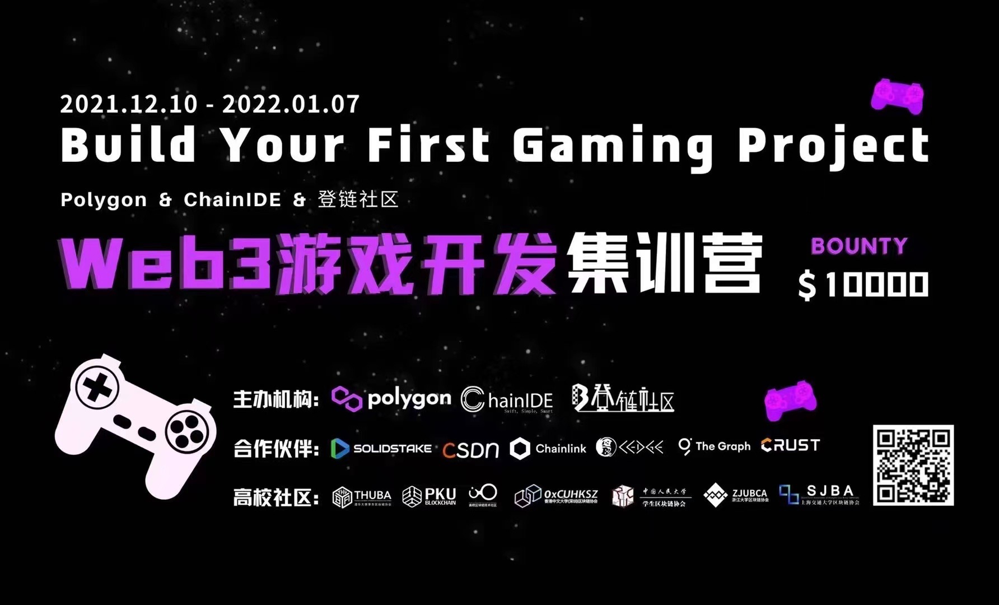
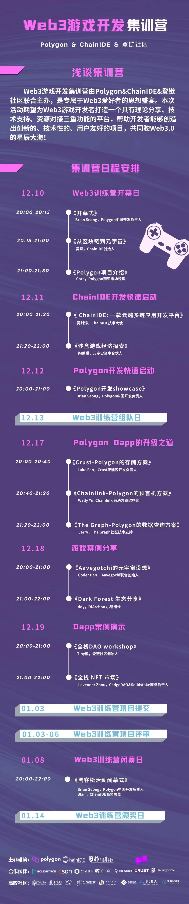

# 2021 Web3 游戏开发者训练营 - 1万美金Bounty！

Web3游戏开发集训营由Polygon&ChainIDE&登链社区联合主办，是专属于Web3爱好者的思想盛宴。本次活动期望为Web3游戏开发者打造一个具有理论分享、技术支持、资源对接三重功能的平台，帮助开发者能够创造出创新的、技术性的、用户友好的项目，共同驶向Web3.0的星辰大海！参赛团队将有机会获得$10000美金奖励并且能够直接与头部资本深入对接！

我们邀请到了ChainIDE创始人吴啸、Polygon南亚市场经理Cora、登链社区创始人Tiny熊、元宇宙资本合伙人陶荣祺、Crust亚洲区开发负责人Luke Fan、Chainlink 解决方案架构师Wally Yu、The Graph社区技术支持Jerry、Aavegochi联合创始人Coder Dan、DfArchon小组组长ddy、CedgeDAO&Solidstake商务负责人Lavender Zhou、Polygon中国开发负责人Brian Seong、ChainIDE技术大使吴封涛等不同社区知名大咖倾力加盟Web3游戏开发集训营。

Web3游戏开发集训营课程分享将以线上直播形式开展，活动全程免费，此外，导师会在Web3游戏集训营社群内进行技术答疑。

## 主办方介绍

Polygon作为区块链行业Web3时代的引领者，其愿景是成为全球第一且唯一的Layer2聚合器，致力于解决目前以太坊高拥堵、高gas的痛点。Polygon生态中有超5000+多样化Dapp，涉及DEX、NFT、DeFi、GameFi等领域。Polygon提供PoS、Plasma、zkRollups、Optimistic Rollups、Validium、Hermez ZKEVM,  Polygon Miden, Polygon Zero, Polygon NightFall等多种Layer2技术解决方案，在保护系统和实现治理中发挥重要作用。

ChainIDE是纯白矩阵自主研发的全球首个云端多链的区块链集成开发环境，支持包括FaceBook Diem、蚂蚁链、以太坊、微众银行FiscoBcos、Polygon、华为鲲鹏、趣链飞洛等知名区块链底层环境。ChainIDE提供云端编译功能，无需繁琐的安装设置，加速开发迭代速度，也是全球区块链开发者最大的流量入口。 

登链社区（Learnblockchain.cn）是一个专注于区块链技术内容的开发者社区，汇聚了国内优质的区块链技术专家、文章、问答、文档等技术资源，社区用户超过130万，是国内区块链开发者们最喜爱的学习交流平台。

## 活动流程

活动视频可以点击下面的链接：

### Day 1: Web3游戏训练营开幕日

- 🔹 开幕式 (Brian Seong | Polygon中国开发者社区负责人)
- 🔹 从区块链到元宇宙 (吴啸 | ChainIDE创始人)
- 🔹 Polygon介绍 (Cora | Polygon南亚市场经理)
- 🤙 共计接近2000人参与本次活动

📺 视频链接：[Bilibili](https://www.bilibili.com/video/BV1Li4y1d7rs), [CSDN](https://live.csdn.net/room/weixin_32256545/Pv5t3v0U)

### Day 2: ChainIDE开发快速启动

- 🔹 ChainIDE: 一款云端多链应用开发平台（吴封涛，ChainIDE技术大使）
- 🔹 沙盒游戏经济探索（陶荣祺，元宇宙资本合伙人）
- 🤙 共计接近1100+人参与本次活动

📺 视频链接：[Bilibili](https://www.bilibili.com/video/BV1Da411r7nL), [CSDN](https://live.csdn.net/room/weixin_32256545/1VYHnVPd)
💻 Workshop的代码链接: [ChainIDE Workshop](https://github.com/Polygon-Academy/Tutorial-ChainIDE)

### Day 3: Polygon开发快速启动

- 🔹 Polygon开发showcase（Brian Seong，Polygon中国开发负责人）
- 🤙 共计接近1000+人参与本次活动

📺 视频链接：[Bilibili](https://www.bilibili.com/video/BV1kF411z7Hw), [CSDN](https://live.csdn.net/room/weixin_32256545/gSJ3l3SL)
💻 Workshop中所有的链接[Polygon Workshop Bookmarks](./PolygonWorkshopLinks.md)

### Day 4: Polygon Dapp的升级之道

- 🔸Crust - Storage on Polygon（Luke Fan，Crust亚洲开发负责人）
- 🔸Chainlink - Oracle on Polygon（Wally Yu/ Chainlink解决方案架构师）
- 🔸The Graph - Data Query on Polygon（Jerry，The Graph社区技术支持）
- 🤙 共计接近700+人参与本次活动

📺 视频链接：[Bilibili](https://www.bilibili.com/video/BV1hr4y1U74r), [CSDN](https://live.csdn.net/room/weixin_32256545/w1YvqVKf)
💻 CrustNetwork的workshop链接[workshop链接](https://github.com/Polygon-Academy/Tutorial-CrustNetwork)

### Day 5: Web3游戏案例分享

- 🔸Aavegochi的元宇宙设想（Coder Dan, Pixelcraft Studios联合创始人）
- 🔸Dark Forest 黑暗森林生态（ddy, DfArchon小组组长）
- 🤙 共计接近1100+人参与本次活动

📺 视频链接：[Bilibili](https://www.bilibili.com/video/BV1NQ4y1Y7cA), [CSDN](https://live.csdn.net/room/weixin_32256545/bMJbh5hv)

### Day 6: Dapp案例演示

- 🔸全栈DAO workshop（Tiny熊，登链社区发起人）
- 🔸全栈 NFT 市场（Lavender Zhou，CedgeDAO & Solidstake商务负责人）
- 🤙 共计接近1200+人参与本次活动

📺 视频链接：[Bilibili](https://www.bilibili.com/video/BV1Mi4y1o7fN), [CSDN](https://live.csdn.net/room/weixin_32256545/9ypf9GNq)
💻 Workshop中的链接：[DAO Workshop](https://github.com/Polygon-Academy/Tutorial-DAO)、[NFT市场Workshop](https://github.com/Polygon-Academy/Tutorial-nft-marketplace)

## Bounty 设置

### 最佳gaming dapp：$7000

- 第一名：$4000
- 第二名：$2000
- 第三名：$1000

在 Polygon 上部署您的游戏 Dapp，Bounty总奖金为 7000 美金！随着大家对区块链游戏的兴趣日益浓厚，我们也非常鼓励在 Polygon 上部署的各种游戏相关项目。你的游戏不一定需要是一个完整的产品，只要能提供一个有效的演示即可。

一些例子：
- YGG-Yield Guild Games https://yieldguild.io/
- Axie Infinity https://axieinfinity.com/
- Dark Forest (zkga.me) https://zkga.me/
- Horizon  https://horizon.io/
- MOMOverse https://www.mobox.io/#/

### Polygon生态最佳大学生项目：$1000

本奖项专门为鼓励大学生参赛者设置，我们鼓励学习和尝试在polygon上开发元宇宙相关项目，会给最佳大学生项目颁发$1000奖励，欢迎一切有意思的元宇宙生态创新。要求是团队里所有人都是学生。

一些例子：
- POAP https://poap.xyz/
- Mirror https://mirror.xyz/

### Polygon奖学金：$1400

在活动结束之前都可以来申请，但在1月7号之后将不再接收问卷。来参与的同学必须已经在我们web3游戏训练营的微信群里。

对于从未使用过Polygon网络的同学，可以申请价值 5 USDT 的 Matic 来试用 Polygon。
这个奖学金主要面向学生提供。

申请入口：[《Polygon奖学金》](https://www.wenjuan.com/s/UZBZJvCdjQ/)

### 最佳Polygon Gaming生态调研文章（3篇）：$600

我们会选出三篇深度调研Polygon Gaming生态的文章各发放$200奖励。

## Bounty提交要求

具体提交要求点击[这里](./HowToSubmit.md)

## 组队

### 建议

最好最终的结果能够以完整的solution的方式展现出来，那可能就会需要前端、智能合约端、后端、模型及产品设计等不同的人。不同领域的人聚集在一块能够brainstorm出更加有意思的idea～！

### 要求

建议组队不超过5个人，并且每个人都有自己负责的模块。
组队的deadline是北京时间12月19号晚上23:59分，鼓励大家尽快组织起自己的队伍～！12月20日下午16点前公布最终组队情况。

### 提交组队信息

我们鼓励各位开发者以及高校学生们来组队参加我们的bounty，下面是你的组队信息填写的入口：

| 组好队的请扫这里 | 没有组队希望被分配的请扫这里 |
| ------------- | ------------------------ |
|  |  |

***最终组好队的小组，假若最后你们小组提交了你们的bounty项目，那么该小组的每个组员都将获得 <u>5 Matic</u> 的奖学金（每人仅限领取一次奖学金）。***

## 你的收获

1. 沉浸式体验一款区块链游戏开发全过程
2. 结识中国最具活力的技术开发者，并组团开发项目
3. 零距离接触生态技术大牛
4. 行业顶尖资本对接的机会
5. 获得全球元宇宙生态资源
6. 优秀作品们可以获得Polygon 10K bounty

## 找到你的组织

### Telegram 
- Polygon中文开发者社群：https://t.me/PolygonChina_Dev
- ChainIDE中文开发者社群：https://t.me/+Q48BNwB-f8RlZTJl

### Discord
- Polygon中文频道：https://discord.gg/bqGjrhZSMN
- ChainIDE中文频道：https://discord.gg/YEMUDPXvUJ

### Github
- Polygon：https://github.com/Polygon-Academy/Polygon-in-Chinese
- ChainIDE：https://github.com/WhiteMatrixTech
